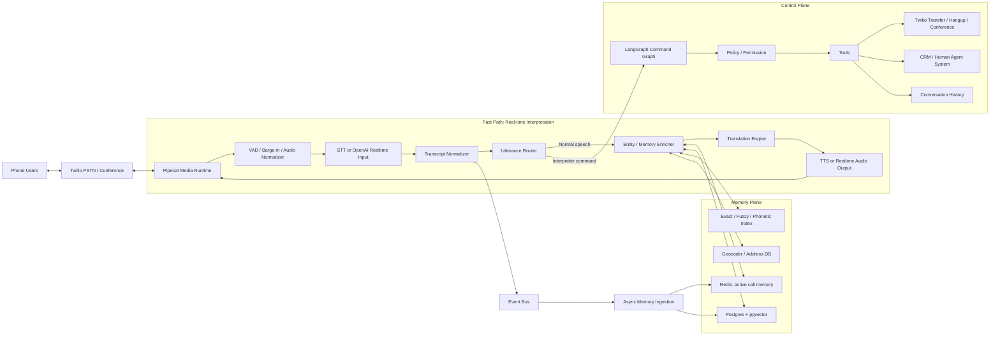
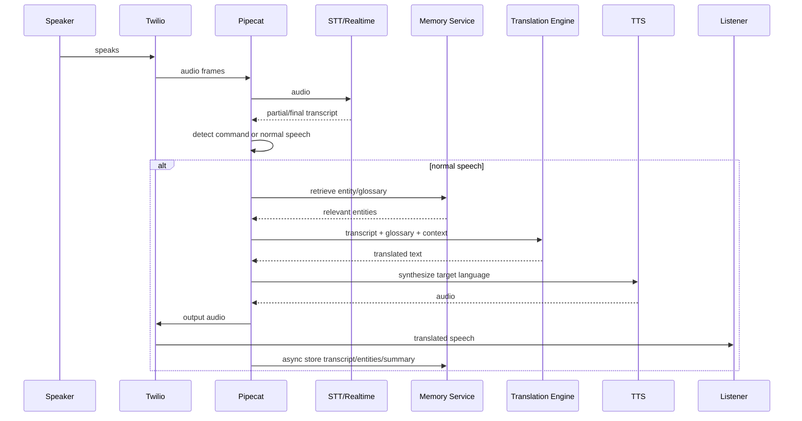
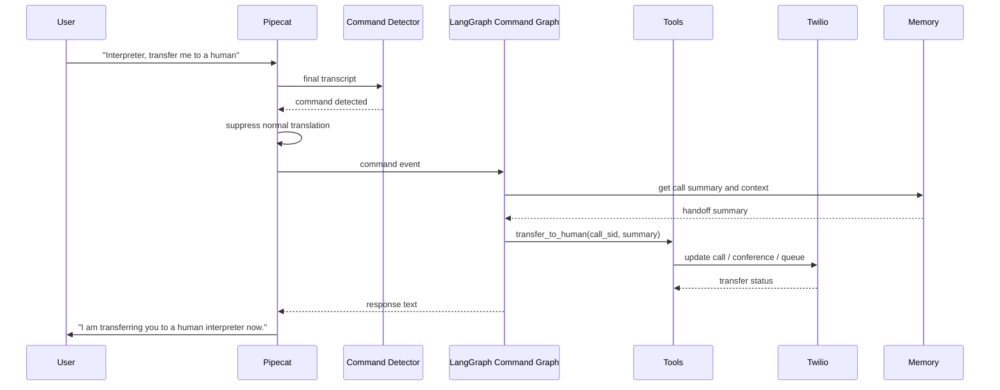
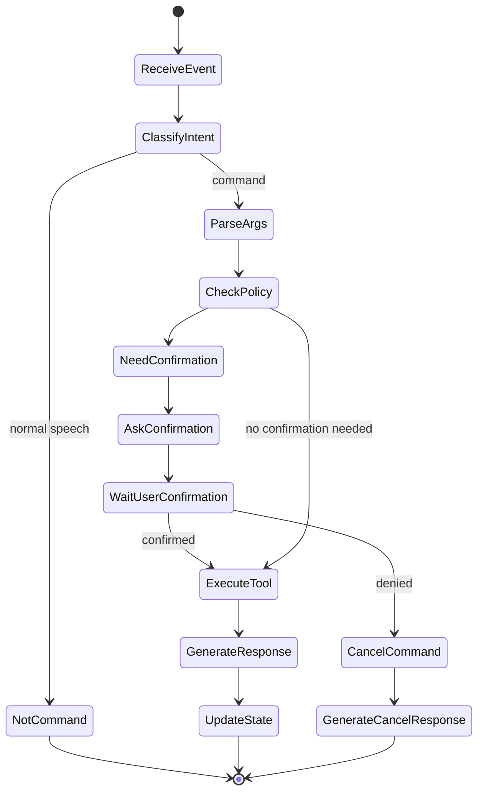

下面是可直接保存成 `ultimate-plan.md` 的版本。

---

# Ultimate Plan.md — Advanced Voice Interpretation AI Agent

## 0. 结论先说

推荐架构不是“Pipecat vs LangGraph vs OpenAI Realtime 三选一”，而是：

> **Pipecat 做实时音频/电话 data plane；LangGraph 做 command/control plane；OpenAI Realtime 可作为低延迟语音模型引擎，但不要让它独自承担整个业务编排。**

最佳路线：

1. **继续保留 Pipecat + Twilio**，因为你已经跑通电话链路，Pipecat 很适合处理 audio frames、VAD、barge-in、STT/TTS pipeline。
2. **引入 LangGraph，但只用于低频、状态化、业务型 workflow**：  
   例如 interpreter commands、human transfer、pause/resume、previous conversation summary、memory policy。
3. **Memory/entity retrieval 不一定要全部进 LangGraph**。  
   正常翻译 hot path 上应该用一个轻量 `Memory/Entity Enricher`，避免每句话都跑复杂 agent graph。
4. **OpenAI Realtime 适合做低延迟 speech-to-speech 口译引擎**，尤其是电话实时性要求高时。  
   但 human transfer、权限、历史记忆、Twilio call control，仍然建议在你自己的 backend / LangGraph 里控制。

---

## 1. 目标

你要做的是一个高级电话口译 AI agent，核心能力包括：

### 1.1 实时口译

- 用户 A 说英文，系统翻译给用户 B。
- 用户 B 说中文，系统翻译给用户 A。
- 保持第一人称、语气、中立性。
- 支持打断、暂停、重复、慢速朗读。

### 1.2 Memory-aware translation

当听到 entity，例如：

- street name
- person name
- company name
- hospital/clinic name
- case number
- address
- order number

系统应该：

1. 从当前 call memory 搜索。
2. 从 long-term user/org memory 搜索。
3. 从 external DB/CRM/map/geocoder 搜索。
4. 把高置信度 entity 注入翻译上下文。
5. 避免把 street name 乱翻译或 hallucinate。

例子：

> ASR 听到 “Wooster Street”  
> Memory 里知道用户地址是 “Worcester Street”，pronounced “Wooster”  
> 翻译时输出：  
> “Worcester Street”，必要时补充拼写。

### 1.3 Interpreter commands

用户可以对 AI 口译员发指令，而不是让它翻译这句话。

例如：

- “Interpreter, pause.”
- “Interpreter, stop translating.”
- “Interpreter, repeat the last sentence.”
- “Interpreter, summarize the previous conversation.”
- “Interpreter, transfer me to a human.”
- “Interpreter, speak slower.”
- “Interpreter, switch to literal translation.”
- “Interpreter, remember this street name as Worcester Street.”

这些 commands 需要被识别、执行，而不是直接翻译给对方。

---

## 2. 技术选型判断

| 能力 | Pipecat | LangGraph | OpenAI Realtime |
|---|---|---|---|
| Twilio phone audio pipeline | 很适合 | 不适合 | 可以接入，但通常需要 bridge |
| VAD / barge-in / audio frames | 很适合 | 不适合 | 支持，但业务控制弱 |
| STT/LLM/TTS 编排 | 很适合 | 一般 | 很适合低延迟 |
| 实时 speech-to-speech | 可编排 | 不适合 | 很适合 |
| interpreter commands | 可做 router | 很适合 workflow | 可用 tool call 触发 |
| memory retrieval | 可做 processor | 可做复杂流程 | 可通过 tools，但不应完全依赖 |
| human transfer | 可调用 Twilio | 很适合 | 不适合直接管业务 |
| durable state | 需要外部 store | 很适合 | 不适合作为主状态 |
| vendor portability | 高 | 高 | 较低 |

### 最终选择

#### MVP / 稳定版

```text
Twilio + Pipecat + STT + LLM translation + TTS
                 + Memory Service
                 + LangGraph Command Control
```

#### 低延迟增强版

```text
Twilio + Pipecat + OpenAI Realtime
                 + Memory Sidecar
                 + LangGraph Command Control
```

不要把 LangGraph 放在每个 audio frame 的 hot path 上。  
LangGraph 应该处理 command、transfer、summary、state transition。  
正常一句话翻译应该走 fast path。

---

## 3. 总体架构图



核心思想：

- **Fast path**：必须快，负责实时听、翻译、说。
- **Control plane**：可以稍慢，负责 commands 和业务动作。
- **Memory plane**：给 fast path 提供 entity/glossary，不要阻塞太久。
- **Async ingestion**：每个 turn 后异步更新 memory、entities、summary。

---

## 4. Pipecat Pipeline 设计

推荐的 Pipecat pipeline：

```text
TwilioInputTransport
  -> AudioNormalizer
  -> VAD / Barge-in
  -> STTService 或 OpenAIRealtimeInput
  -> TranscriptNormalizer
  -> CommandDetector
  -> RouteDecision

    if command:
        -> LangGraphCommandProcessor
        -> CommandResponseTTS
        -> TwilioOutputTransport

    else:
        -> EntityMemoryRetriever
        -> Prompt/ContextBuilder
        -> TranslationLLM 或 OpenAIRealtime
        -> TTSService
        -> TwilioOutputTransport

  -> AsyncTranscriptLogger
  -> AsyncEntityExtractor
  -> AsyncSummaryUpdater
```

### 关键原则

1. **CommandDetector 必须在 translation 之前。**  
   否则 “Interpreter, transfer me to a human” 会被翻译给对方，而不是执行。

2. **MemoryRetriever 要轻量。**  
   对每个 final transcript 做 entity retrieval 可以，但不要每个 audio frame 调 LangGraph。

3. **Entity extraction 可以异步。**  
   当前 turn 翻译时用已有 cache，下一 turn 再用新 memory。

4. **对 critical entities 要允许 clarification。**  
   比如地址、case number、药名，如果置信度低，可以说：  
   “Could you please spell the street name?”

---

## 5. Call Topology

### 5.1 单人和 AI 通话

这是最简单的架构：

```text
Caller <-> Twilio Call <-> Pipecat <-> AI Interpreter
```

适合：

- 用户打电话给 AI 翻译。
- AI 和用户一问一答。
- 不需要把 A 的话单独播放给 B。

### 5.2 两个人之间的实时口译

如果是真正 A/B 双方通话，推荐：

```text
Participant A Call Leg ----\
                             Twilio Conference / Bridge ---- Pipecat
Participant B Call Leg ----/
```

重要原则：

> 不要只拿一个 mixed audio track 来做双人翻译。  
> 最好每个 participant 有独立 audio leg / stream。

原因：

- 需要知道是谁在说话。
- A 说的话只应该翻译给 B。
- B 说的话只应该翻译给 A。
- overlapping speech 需要单独处理。
- diarization 在电话音质下不够可靠。

如果现在你的项目是单 call leg，可以先做单人版本。  
以后升级为 conference / per-leg streams。

---

## 6. Normal Translation Flow



---

## 7. Interpreter Command Flow



---

## 8. LangGraph 应该负责什么

LangGraph 不应该负责每个 audio frame。  
它应该负责这些：

### 8.1 Command workflow

- classify command
- parse arguments
- check permission
- ask confirmation if needed
- execute tool
- update call state
- generate response

### 8.2 Human transfer

- pause AI interpretation
- generate handoff summary
- call Twilio REST API
- transfer to queue/human/conference
- notify CRM or human dashboard
- log transfer reason

### 8.3 Conversation recall

- summarize last N turns
- retrieve previous call summaries
- filter private/sensitive content
- respond to requesting participant

### 8.4 State management

Example states:

```text
ACTIVE_TRANSLATING
PAUSED
COMMAND_PENDING
CLARIFYING_ENTITY
HUMAN_TRANSFER_PENDING
HUMAN_TRANSFERRED
ENDING_CALL
ERROR_FALLBACK
```

### 8.5 LangGraph state schema

```yaml
InterpreterState:
  call_id: string
  twilio_call_sid: string
  mode: active | paused | transferring | ended
  participants:
    - id: string
      call_sid: string
      language: string
      role: caller | callee | human_agent
  last_turns:
    - speaker_id: string
      source_text: string
      translated_text: string
      timestamp: string
  entity_cache:
    - surface: string
      canonical: string
      type: street | person | org | address | case_number
      confidence: number
  glossary:
    - term: string
      instruction: string
  pending_command:
    intent: string
    args: object
    confidence: number
  transfer:
    status: none | requested | queued | connected | failed
    reason: string
```

---

## 9. Command Detection 设计

### 9.1 推荐 command 触发方式

强烈建议使用 wake phrase：

- “Interpreter, ...”
- “Translator, ...”
- “翻译员，...”
- “口译员，...”
- “Intérprete, ...”

这样可以降低误判。

### 9.2 Command classifier output

```json
{
  "is_command": true,
  "intent": "transfer_to_human",
  "confidence": 0.94,
  "args": {
    "reason": "user requested human interpreter"
  },
  "requires_confirmation": true,
  "target_scope": "requesting_user_only"
}
```

如果 confidence 低于阈值，例如 0.75：

- 默认当普通话翻译。
- 或者问一句：  
  “Did you want me to execute a command, or translate that?”

### 9.3 Command categories

#### Non-destructive commands

可以直接执行：

- repeat last sentence
- speak slower
- speak louder
- summarize current conversation
- spell last entity
- switch to literal translation
- resume translation

#### Destructive / sensitive commands

需要确认：

- stop interpreting
- end call
- transfer to human
- delete memory
- recall previous conversations
- share private summary

### 9.4 支持的 commands

| Command | Action |
|---|---|
| pause | pause interpretation |
| resume | resume interpretation |
| stop | clarify: stop speaking, stop interpreting, or end call |
| repeat | repeat last translation |
| summarize | summarize current/previous conversation |
| previous conversation | retrieve authorized history |
| transfer to human | initiate Twilio transfer |
| speak slower | adjust TTS speed |
| literal mode | change translation style |
| natural mode | change translation style |
| spell that | spell last entity |
| remember this as X | update session glossary |
| forget this | remove from memory if allowed |
| change language | update participant language |

---

## 10. Memory / Entity Retrieval 设计

### 10.1 Memory 分层

```text
Active Session Memory
  - 当前通话 transcript
  - rolling summary
  - last N turns
  - active entity cache
  - dynamic glossary

Long-term User Memory
  - previous call summaries
  - common addresses
  - names
  - preferences
  - approved terminology

Org / Domain Memory
  - CRM contacts
  - location database
  - product names
  - medical/legal terminology
  - business-specific glossary

External Knowledge
  - geocoder
  - map/address API
  - public place database
```

### 10.2 Storage 推荐

| Data | Storage |
|---|---|
| active call state | Redis |
| transcript and turns | Postgres |
| embeddings | Postgres + pgvector |
| fuzzy search | Postgres trigram / Elasticsearch / Meilisearch |
| audio recordings | S3/GCS |
| call summaries | Postgres |
| entity table | Postgres |

### 10.3 Entity table

```sql
entities:
  id
  call_id
  user_id
  surface_text
  canonical_text
  entity_type
  language
  confidence
  source_turn_id
  metadata_json
  created_at
```

### 10.4 Turn table

```sql
turns:
  id
  call_id
  speaker_id
  source_language
  target_language
  source_text
  corrected_source_text
  translated_text
  stt_confidence
  started_at
  ended_at
  audio_uri
```

### 10.5 Entity retrieval pipeline

```text
Final transcript
  -> detect possible entity spans
  -> generate candidates
      - exact match
      - fuzzy match
      - phonetic match
      - vector search
      - geocoder / CRM lookup
  -> rerank candidates
  -> choose canonical entity if confidence high
  -> inject into translation prompt
  -> update session glossary
```

### 10.6 Street name 特殊处理

Street name 不能只靠 vector search。  
应该使用 hybrid matching：

1. exact match
2. case-insensitive match
3. edit distance
4. phonetic matching
5. locale-aware geocoder
6. user-specific address book
7. previous call memory
8. ASR alternatives if available

例子：

```text
Raw ASR:
"I live on Wooster Street."

Candidate:
Worcester Street
source: previous memory
pronunciation: "Wooster"
confidence: 0.91

Glossary injected:
- Worcester Street: street name, pronounced "Wooster"; preserve exact spelling.
```

翻译输出：

```text
我住在 Worcester Street。
```

必要时：

```text
我住在 Worcester Street，拼写是 W-O-R-C-E-S-T-E-R。
```

### 10.7 Confidence policy

```text
confidence >= 0.85:
  silently use canonical entity

0.65 <= confidence < 0.85:
  preserve raw text, optionally ask clarification if critical

confidence < 0.65:
  do not correct, do not hallucinate
```

---

## 11. Translation Prompt Strategy

### 11.1 Normal interpreter system instruction

```text
You are a professional neutral interpreter.

Translate faithfully between the participants.
Use first person when appropriate.
Do not answer the speaker's questions yourself.
Do not add explanations unless required for clarity.
Preserve names, addresses, case numbers, and proper nouns.
Use the provided glossary and entity memory.
If an entity is uncertain and critical, ask for clarification.
If the speaker addresses the interpreter with a command wake phrase,
do not translate it; route it as a command.
```

### 11.2 Per-turn context

每次翻译只注入短上下文：

```text
Recent context:
- Speaker A is discussing an appointment.
- The destination is likely Worcester Street.

Glossary:
- Worcester Street: street name, preserve spelling, pronounced "Wooster".
- Dr. Nguyen: person name, preserve as "Dr. Nguyen".

Source:
"I need to go to Wooster Street tomorrow morning."

Task:
Translate into Mandarin Chinese.
```

### 11.3 不要把全部历史塞进 prompt

用：

- rolling summary
- last 3-5 turns
- relevant entities
- small glossary

不要每句话塞完整 transcript。  
这样 latency 低，成本低，也减少模型跑偏。

---

## 12. OpenAI Realtime 的使用方式

### 12.1 什么时候用 OpenAI Realtime

适合：

- 你需要更低 latency。
- 想减少 STT → LLM → TTS 串联延迟。
- 想要自然 barge-in。
- 想做 voice-to-voice interpretation。

### 12.2 什么时候暂时不用

如果你更需要：

- 完全可控 transcript
- deterministic routing
- 自己控制每句话 prompt
- 多 provider fallback
- debugging 和 evaluation

那先用 Pipecat + separate STT/LLM/TTS 更容易。

### 12.3 推荐集成模式

#### 模式 A：Pipecat orchestration + OpenAI Realtime engine

```text
Twilio
  -> Pipecat
  -> OpenAI Realtime
  -> Pipecat
  -> Twilio
```

Pipecat 仍然负责：

- Twilio transport
- call state
- command interception
- memory sidecar
- transfer control
- logging
- fallback

OpenAI Realtime 负责：

- low-latency audio understanding
- speech response
- maybe translation
- maybe simple tool calls

#### 模式 B：Realtime tool call 触发 LangGraph

```text
OpenAI Realtime detects:
"Interpreter, transfer me to a human"

Realtime tool call:
execute_interpreter_command(intent="transfer_to_human")

Backend:
LangGraph executes workflow
```

但不要让 Realtime 直接操作 Twilio。  
Realtime 应该 call 你的 backend tool，由 LangGraph 决策。

### 12.4 Realtime + Memory

两种方式：

#### Option 1: sidecar glossary update

Memory service 持续监听 transcript，更新当前 glossary。  
然后 backend 定期 `session.update` 给 Realtime：

```text
Current glossary:
- Worcester Street: preserve exact spelling.
- Dr. Nguyen: person name.
```

优点：快、稳定。

#### Option 2: Realtime tool call search_memory

Realtime 模型遇到 entity 时调用：

```json
{
  "tool": "search_entity_memory",
  "arguments": {
    "query": "Wooster Street",
    "entity_type": "street"
  }
}
```

缺点：tool call 可能阻塞实时口译。  
所以建议只在高价值/低置信度 entity 时使用。

---

## 13. Human Transfer 设计

### 13.1 Transfer command

用户说：

```text
Interpreter, transfer me to a human.
```

流程：

1. CommandDetector 识别。
2. 暂停 normal translation。
3. LangGraph 检查是否需要确认。
4. 生成 handoff summary。
5. 调用 Twilio API。
6. 转到 human queue / conference / agent number。
7. 人类接入后 AI pause 或退出。

### 13.2 Handoff summary

给 human interpreter 的 summary：

```yaml
languages:
  caller: English
  other_party: Mandarin Chinese

reason:
  User requested human interpreter.

summary:
  The caller is trying to confirm an appointment and address.

important_entities:
  - Worcester Street
  - Dr. Nguyen
  - appointment tomorrow morning

last_turns:
  - User: "I need to go to Worcester Street tomorrow morning."
  - Translation: "我明天早上需要去 Worcester Street。"
```

### 13.3 Twilio 实现方向

取决于你现在的 Twilio setup，可以用：

- update current call TwiML
- Dial human number
- enqueue into Twilio Queue
- add human into Conference
- warm transfer
- cold transfer

建议先做：

```text
AI says: "I am transferring you now."
Generate summary.
Redirect call to human queue.
```

以后再做 warm transfer。

---

## 14. LangGraph Command Graph



### 14.1 Tool list

```python
tools = [
    "pause_interpretation",
    "resume_interpretation",
    "repeat_last_translation",
    "summarize_recent_conversation",
    "search_previous_conversations",
    "set_translation_mode",
    "set_tts_speed",
    "spell_last_entity",
    "remember_entity",
    "forget_entity",
    "transfer_to_human",
    "end_call"
]
```

---

## 15. 推荐代码模块划分

```text
src/
  app.py

  transports/
    twilio_transport.py

  pipeline/
    interpreter_pipeline.py
    command_detector.py
    route_decision.py
    entity_memory_enricher.py
    translation_context_builder.py

  graph/
    command_graph.py
    state.py
    nodes/
      classify_command.py
      check_policy.py
      execute_tool.py
      generate_response.py

  memory/
    entity_store.py
    vector_store.py
    fuzzy_search.py
    geocoder.py
    summarizer.py
    retrieval.py

  services/
    stt.py
    tts.py
    realtime.py
    translation_llm.py
    twilio_tools.py
    crm_tools.py

  schemas/
    turn.py
    entity.py
    command.py
    call_state.py

  prompts/
    interpreter_system.md
    translation_turn.md
    command_classifier.md

  evals/
    test_commands.py
    test_entities.py
    test_latency.py
```

---

## 16. Pseudocode

### 16.1 Main turn handling

```python
async def on_final_transcript(turn: Turn):
    command = await command_detector.detect(turn.text, turn.language)

    if command.is_command and command.confidence >= 0.80:
        # Do not translate command to the other party.
        await audio_controller.cancel_current_tts_if_needed()

        result = await command_graph.ainvoke({
            "call_id": turn.call_id,
            "speaker_id": turn.speaker_id,
            "command": command,
            "last_turns": await memory.get_recent_turns(turn.call_id),
        })

        if result.response_text:
            await speak_to_participant(
                participant_id=turn.speaker_id,
                text=result.response_text,
                language=turn.language,
            )

        return

    # Normal translation path
    glossary = await memory.retrieve_relevant_glossary(
        call_id=turn.call_id,
        user_id=turn.user_id,
        text=turn.text,
        source_language=turn.language,
    )

    translated = await translator.translate(
        source_text=turn.text,
        source_language=turn.language,
        target_language=turn.target_language,
        glossary=glossary,
        recent_context=await memory.get_rolling_summary(turn.call_id),
    )

    await speak_to_target_participant(
        source_speaker_id=turn.speaker_id,
        text=translated.text,
        language=turn.target_language,
    )

    # Async memory update
    background_tasks.add_task(memory.ingest_turn, turn, translated)
```

### 16.2 Entity retrieval

```python
async def retrieve_relevant_glossary(call_id: str, text: str):
    spans = await entity_detector.detect_spans(text)

    results = []

    for span in spans:
        candidates = []

        candidates += await exact_index.search(span.text)
        candidates += await fuzzy_index.search(span.text)
        candidates += await phonetic_index.search(span.text)

        if span.type in ["address", "street", "place"]:
            candidates += await geocoder.search(span.text)

        candidates += await vector_store.search(
            query=span.text,
            filter={"call_id": call_id},
            top_k=5,
        )

        best = rerank(span, candidates)

        if best.confidence >= 0.85:
            results.append(best)

    return build_glossary(results)
```

---

## 17. Latency Budget

目标口译体验：

```text
speech end -> translated audio start < 1.2s ideally
```

建议 budget：

| Step | Target |
|---|---|
| VAD end detection | 100-300ms |
| STT final | 200-500ms |
| command detection | 20-100ms |
| memory retrieval | 20-150ms |
| translation LLM | 300-800ms |
| TTS first audio | 150-400ms |

优化策略：

1. partial transcript 时提前 prefetch entity。
2. memory retrieval 设置 timeout，例如 150ms。
3. retrieval 超时就继续翻译，不阻塞。
4. glossary cache 放 Redis。
5. TTS streaming。
6. barge-in 时 cancel TTS。
7. Realtime 模式作为低延迟版本。

---

## 18. Evaluation Plan

### 18.1 Metrics

| Metric | Goal |
|---|---|
| translation latency | p50 < 1.2s |
| command precision | > 95% |
| command recall | > 90% |
| entity canonicalization accuracy | > 90% for known entities |
| false entity correction rate | < 2% |
| human transfer success | > 99% |
| barge-in response time | < 300ms |

### 18.2 Test dialogs

准备 golden test set：

- street names:
  - Worcester / Wooster
  - Main / Maine
  - Reading / Redding
  - Houston Street / Houston city
- names:
  - Nguyen
  - Zhang
  - José
  - Siobhan
- commands:
  - “Interpreter, pause.”
  - “Tell him to pause.” 这个应该翻译，不应该执行 command。
  - “Interpreter, tell him I want to pause.” 这个要判断。
- transfer:
  - direct request
  - accidental mention
  - noisy audio
- previous conversation:
  - current call summary
  - previous call summary
  - unauthorized request

---

## 19. Security / Compliance

必须考虑：

1. Twilio webhook signature verification。
2. PII encryption at rest。
3. Redis/Postgres access control。
4. Call recording consent。
5. Data retention policy。
6. User identity verification before recalling previous conversations。
7. Human transfer summary should not leak unnecessary sensitive info。
8. “delete memory” command should be supported if product需要。
9. HIPAA/legal/medical scenarios 要额外合规。
10. Logs 里不要裸露 full audio 或 sensitive transcript。

---

## 20. Implementation Roadmap

### Phase 1 — 稳定现有 Pipecat 电话链路

目标：

- 确保 Twilio call in/out 稳定。
- 有 final transcript events。
- 有 translated text logs。
- 有 TTS barge-in/cancel。

Deliverables：

- `Turn` schema
- transcript logging
- latency logging
- call state store

---

### Phase 2 — Command MVP

目标：

- 加入 wake phrase command detection。
- 支持 pause/resume/repeat/speak slower。
- command 不被翻译给对方。

Deliverables：

- `CommandDetector`
- `CommandGraph`
- command response TTS
- tests for false positives

---

### Phase 3 — Entity Memory MVP

目标：

- 当前 call 内 entity extraction。
- Redis entity cache。
- glossary injection。
- street/name fuzzy matching。

Deliverables：

- `EntityMemoryRetriever`
- `EntityStore`
- `GlossaryBuilder`
- address/name test set

---

### Phase 4 — Long-term Memory

目标：

- previous conversations summary。
- user-level memory。
- authorized retrieval。
- “what did we discuss earlier?” command。

Deliverables：

- Postgres + pgvector
- rolling summarizer
- previous conversation retriever
- privacy policy

---

### Phase 5 — Human Transfer

目标：

- transfer to human command。
- Twilio queue/conference integration。
- handoff summary。

Deliverables：

- `transfer_to_human` tool
- Twilio REST call update
- human dashboard/webhook
- fallback if transfer fails

---

### Phase 6 — OpenAI Realtime Experiment

目标：

- 用 Realtime 替换或增强 STT/LLM/TTS。
- 保留 Pipecat orchestration。
- 保留 LangGraph commands。
- 对比 latency 和 translation quality。

Deliverables：

- Realtime adapter
- transcript mirroring
- tool call bridge to LangGraph
- A/B latency evaluation

---

## 21. 最终推荐架构

```text
                 ┌──────────────────────────┐
                 │          Twilio           │
                 │  PSTN / Conference / WS   │
                 └─────────────┬────────────┘
                               │
                               ▼
                 ┌──────────────────────────┐
                 │         Pipecat           │
                 │  real-time media runtime  │
                 └─────────────┬────────────┘
                               │
          ┌────────────────────┼────────────────────┐
          │                    │                    │
          ▼                    ▼                    ▼
 ┌────────────────┐   ┌────────────────┐   ┌────────────────┐
 │ Fast Translate │   │ Command Router │   │ Async Logging  │
 │ STT/Realtime   │   │ Wake phrase    │   │ Transcript     │
 │ Memory enrich  │   │ Intent detect  │   │ Entities       │
 │ Translation    │   └───────┬────────┘   └───────┬────────┘
 │ TTS/Realtime   │           │                    │
 └────────────────┘           ▼                    ▼
                    ┌──────────────────┐   ┌──────────────────┐
                    │    LangGraph      │   │ Memory Services  │
                    │ command workflows │   │ Redis/Postgres   │
                    │ transfer/control  │   │ pgvector/fuzzy   │
                    └─────────┬────────┘   └──────────────────┘
                              │
                              ▼
                    ┌──────────────────┐
                    │ Twilio / CRM /   │
                    │ Human Agents     │
                    └──────────────────┘
```

---

## 22. 最重要的设计原则

1. **Pipecat 不要丢。**  
   你已经有 Twilio 电话项目，Pipecat 是正确 foundation。

2. **LangGraph 不要放 audio hot path。**  
   它适合 command、workflow、state，不适合处理每 20ms audio frame。

3. **OpenAI Realtime 是 model engine，不是完整产品架构。**  
   可以用它降低延迟，但业务控制仍然要在你自己的 backend。

4. **Memory retrieval 要 hybrid。**  
   Street name / person name 不能只靠 vector search。  
   要 exact + fuzzy + phonetic + domain DB + geocoder。

5. **Command 必须有 wake phrase。**  
   否则很容易把普通对话误判成系统指令。

6. **低置信度 entity 不要乱改。**  
   宁可 ask clarification，也不要把地址翻译错。

7. **human transfer 必须是 first-class workflow。**  
   不只是一个 LLM tool call，而是 Twilio + state + summary + fallback。

---

## 23. 你现在应该先做的 5 件事

1. 在现有 Pipecat pipeline 里加入 `FinalTranscriptProcessor`。
2. 做一个 `CommandDetector`，先支持：
   - pause
   - resume
   - repeat
   - summarize
   - transfer to human
3. 建一个 Redis-based active memory：
   - last turns
   - entity cache
   - glossary
4. 在 translation prompt 里注入 glossary。
5. 把 transfer to human 做成 LangGraph tool，而不是直接让 LLM 操作 Twilio。

最终形态：

> **Pipecat = real-time body**  
> **OpenAI Realtime/STT/LLM/TTS = voice intelligence engine**  
> **LangGraph = command brain**  
> **Memory service = context brain**  
> **Twilio = phone/action layer**