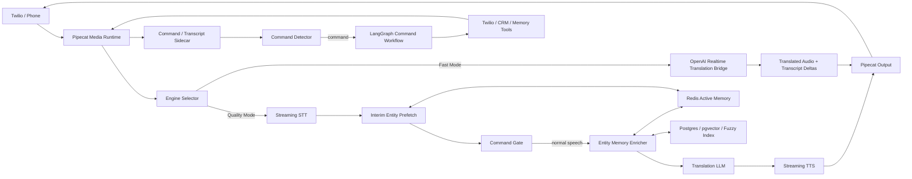

---

但是目标是要让voice+text翻译质量提高 和回复不要太慢/自然
pipecat不是类似这样的pipeline吗？
pipeline = Pipeline([
transport.input(),
stt,
user_aggregator,
llm,
tts,
transport.output(),
assistant_aggregator,
])，

pipecat与其用openai realtime api，或者其他3 tier /modular的deepgram elevenlab之类的会，翻译质量会不会更好，2. 而且你的意思就是langgraph在 llm 这个层面使用吗？会不会拖慢latency？ 直接llm判断不是更快吗？ 3. 而且用openai 怎么用langgraph? 4. *Memory/entity retrieval 是tool吗？还是在langgraph里面call？你也搜下相关需要知道的知识
---


我查了当前相关官方 docs 后，结论要更新一下：

> **如果目标是“voice + text 翻译质量更高，同时回复自然且低延迟”，不要把 LangGraph 放在每句翻译的 hot path。**  
> 推荐你用 **Pipecat 做媒体/runtime**，然后做两个翻译引擎：  
> **Quality Engine = STT → entity/memory → translation LLM → TTS**；  
> **Fast Engine = OpenAI Realtime Translation**。  
> LangGraph 只管 commands / transfer / previous conversation / human handoff 这些 workflow。

---

## 1. OpenAI Realtime vs Deepgram + LLM + ElevenLabs，哪个翻译质量更好？

### 我的判断

**OpenAI Realtime Translation 更可能赢在低延迟和自然度；modular 3-tier 更可能赢在可控性、entity/memory、debug 和文本质量。**

OpenAI 现在官方有专门的 **Realtime Translation session**，模型是 `gpt-realtime-translate`，走 dedicated translation endpoint。它不是普通 voice-agent session，而是持续输入音频、持续输出 translated audio + transcript deltas。官方也明确说，translation session 的模型是 interpreter，不是 assistant；不走普通 `response.create` 生命周期。([developers.openai.com](https://developers.openai.com/api/docs/guides/realtime-translation))

所以：

| 维度 | OpenAI Realtime Translation | Deepgram/OpenAI STT + LLM + ElevenLabs/OpenAI TTS |
|---|---|---|
| **延迟** | 通常更好，边说边翻译 | 会有 STT final、LLM、TTS 串联延迟 |
| **自然口语感** | 通常更自然，因为是 speech/audio-native | 取决于 TTS，ElevenLabs 可以很自然 |
| **entity/street name 控制** | 较弱，不容易在已发出的音频前拦截纠错 | 最强，可以在翻译前做 memory/entity canonicalization |
| **text translation 可控性** | 中等，能拿 input/output transcript delta | 最强，可以做 corrected transcript、glossary、post-edit |
| **commands** | translation session 不适合 tool/workflow | 最适合 command gate + LangGraph |
| **debug/eval** | 较难 | 最容易，每层都有 logs |
| **vendor 可替换性** | 低 | 高 |

OpenAI Realtime speech-to-speech 的优势是没有独立 STT/TTS 中间层，官方说明这种 voice-to-voice 方式可以降低 voice interface latency，并让模型利用语音 tone / inflection。([developers.openai.com](https://developers.openai.com/api/docs/guides/realtime-conversations))  
但如果你要对 **street name、case number、address、药名、姓名** 做强控制，modular path 更安全，因为你可以在 LLM 翻译之前先把实体查出来、纠正、注入 glossary。

### Deepgram + ElevenLabs 不是一定慢

Deepgram streaming 可以用 interim results + endpointing 控制何时触发下游处理；官方建议 conversational pause 场景常用 300–500ms endpointing，并且 interim results 可以实时更新。([developers.deepgram.com](https://developers.deepgram.com/docs/understand-endpointing-interim-results))  
ElevenLabs 也有 streaming / WebSocket TTS，WebSocket endpoint 适合实时 LLM 输出，streaming 可以降低 time-to-first-byte。([elevenlabs.io](https://elevenlabs.io/docs/api-reference/reducing-latency))

所以 modular path 可以做到不错的 latency，但它永远多了几段链路：

```text
audio -> STT -> text normalization/entity retrieval -> translation LLM -> TTS -> audio
```

Realtime translation path 更像：

```text
audio -> realtime translation model -> translated audio + transcripts
```

---

## 2. Pipecat pipeline 应该怎么改？

你说的这个是标准 Pipecat 模式：

```python
pipeline = Pipeline([
    transport.input(),
    stt,
    user_aggregator,
    llm,
    tts,
    transport.output(),
    assistant_aggregator,
])
```

Pipecat 官方也是这个思路：Pipeline 连接 frame processors，音频、文本、control frames 在 processor 之间流动；而且 STT、LLM、TTS provider 可以模块化替换。([docs.pipecat.ai](https://docs.pipecat.ai/guides/learn/pipeline))

但你的产品不是普通 voice assistant，而是 **interpreter**。所以我建议改成：

```python
pipeline = Pipeline([
    transport.input(),

    # 1. STT or transcript source
    stt,

    # 2. partial transcript 时提前查 memory/entity，不阻塞主链路
    InterimEntityPrefetcher(),

    # 3. aggregate final user utterance
    user_aggregator,

    # 4. command gate：先判断是不是 interpreter command
    CommandGate(),

    # 5. normal translation path
    EntityMemoryEnricher(timeout_ms=120),
    TranslationLLM(),
    TTS(),

    transport.output(),
    assistant_aggregator,

    # 6. async logs / memory write
    AsyncTurnLogger(),
    AsyncEntityWriter(),
    AsyncSummaryUpdater(),
])
```

关键不是把 `llm` 换成 LangGraph，而是把 `llm` 前后拆出几个 processor：

```text
STT
 -> CommandGate
 -> EntityMemoryEnricher
 -> TranslationLLM
 -> TTS
```

---

## 3. LangGraph 是放在 LLM 层吗？会不会拖慢？

**不要把 LangGraph 放在每句普通翻译的 LLM 层。**

LangGraph 适合做：

- pause / resume
- repeat
- summarize previous conversation
- transfer to human
- ask confirmation
- update memory
- generate handoff summary
- call Twilio / CRM tools

LangGraph 官方定位是 low-level orchestration framework，重点是 durable execution、streaming、human-in-the-loop、stateful workflow，不是音频 hot path runtime。([docs.langchain.com](https://docs.langchain.com/oss/python/langgraph))

### 正确方式

普通翻译：

```text
final transcript
 -> entity retrieval
 -> translation LLM
 -> TTS
```

command：

```text
final transcript
 -> command detector
 -> LangGraph command workflow
 -> tool action / response
```

也就是说：

```python
if command_detected:
    await command_graph.ainvoke(...)
else:
    await translate_fast_path(...)
```

### 直接 LLM 判断是不是更快？

**是的。**

对于 command detection，最快顺序是：

1. regex / wake phrase：`Interpreter, ...`
2. 小模型 structured classification
3. LangGraph workflow

不要一上来就 LangGraph。

推荐：

```text
CommandGate:
  1. 检查 wake phrase
  2. 如果没有 wake phrase，默认当普通话翻译
  3. 如果有 wake phrase，用小 LLM 做 structured intent classification
  4. 如果是 command，才调用 LangGraph
```

LangGraph 本身的 Python node overhead 通常不是问题，真正拖慢的是你在 graph 里又跑多个 LLM/tool call。LangGraph 的 node 本质上就是同步或异步 Python function，可以读写 state。([docs.langchain.com](https://docs.langchain.com/oss/python/langgraph/graph-api))

---

## 4. OpenAI 怎么和 LangGraph 一起用？

分两种情况。

### 情况 A：普通 text LLM path

你可以在 LangGraph node 里用 `ChatOpenAI`。LangChain 官方 `ChatOpenAI` 支持 OpenAI chat model、tool calling、structured output、async、streaming 等能力。([docs.langchain.com](https://docs.langchain.com/oss/python/integrations/chat/openai))

示意：

```python
from typing import Literal, TypedDict
from pydantic import BaseModel
from langgraph.graph import StateGraph, START, END
from langchain_openai import ChatOpenAI


class CommandDecision(BaseModel):
    is_command: bool
    intent: Literal[
        "pause",
        "resume",
        "repeat",
        "summarize",
        "transfer_to_human",
        "remember_entity",
        "unknown",
    ]
    confidence: float
    requires_confirmation: bool = False


command_llm = ChatOpenAI(
    model="YOUR_FAST_TEXT_MODEL",
    temperature=0,
).with_structured_output(CommandDecision)


class CommandState(TypedDict):
    call_id: str
    speaker_id: str
    text: str
    decision: CommandDecision | None
    response_text: str | None


async def classify_command(state: CommandState):
    decision = await command_llm.ainvoke(
        [
            {
                "role": "system",
                "content": (
                    "Classify interpreter commands. "
                    "Only treat utterances addressed to the interpreter as commands."
                ),
            },
            {"role": "user", "content": state["text"]},
        ]
    )
    return {"decision": decision}


async def execute_command(state: CommandState):
    decision = state["decision"]

    if not decision or not decision.is_command:
        return {"response_text": None}

    if decision.intent == "pause":
        # update Redis call state
        return {"response_text": "Okay, I will pause interpretation."}

    if decision.intent == "transfer_to_human":
        # call Twilio / CRM tool
        return {"response_text": "I am transferring you to a human interpreter now."}

    return {"response_text": "I did not understand that command."}


builder = StateGraph(CommandState)
builder.add_node("classify_command", classify_command)
builder.add_node("execute_command", execute_command)
builder.add_edge(START, "classify_command")
builder.add_edge("classify_command", "execute_command")
builder.add_edge("execute_command", END)

command_graph = builder.compile()
```

然后在 Pipecat `CommandGate` 里：

```python
if looks_like_command(text):
    result = await command_graph.ainvoke({
        "call_id": call_id,
        "speaker_id": speaker_id,
        "text": text,
        "decision": None,
        "response_text": None,
    })
    # suppress normal translation
    # speak result["response_text"] only to requester
```

---

### 情况 B：OpenAI Realtime voice-agent path

如果你用的是普通 Realtime voice-agent session，OpenAI Realtime 支持 function calling。模型会返回 function call arguments，你的 backend 执行函数后再把 tool result 发回去。([developers.openai.com](https://developers.openai.com/api/docs/guides/realtime-conversations))

架构是：

```text
OpenAI Realtime model
  -> function_call: interpreter_command
  -> your backend
  -> LangGraph command_graph
  -> result
  -> send tool result back to Realtime
```

也就是说，Realtime 不直接操作 Twilio / memory / transfer。它只触发你 backend 的 tool。真正 workflow 还是 LangGraph。

---

### 情况 C：OpenAI Realtime Translation path

这个要特别注意。

OpenAI 的 dedicated translation session 和普通 voice-agent session 不一样。Translation session 是持续翻译音频；官方文档说它不走普通 assistant turn lifecycle，不调用 `response.create`，输出 translated audio 和 transcript deltas。([developers.openai.com](https://developers.openai.com/api/docs/guides/realtime-translation))

所以如果你用：

```text
/v1/realtime/translations
model = gpt-realtime-translate
```

那 **commands 和 memory tools 不应该依赖 translation model 内部 tool calling**。

正确架构是 sidecar：

```text
Audio stream
  ├── OpenAI Realtime Translation -> translated audio
  └── Command/Entity Sidecar STT -> command detector / memory prefetch / LangGraph
```

如果 sidecar 检测到：

```text
"Interpreter, pause."
```

你的 backend 就暂停输出 gate，别把这句话翻译给对方，然后调用 LangGraph。

---

## 5. Memory/entity retrieval 是 tool 吗？还是在 LangGraph 里 call？

### 我的建议

**普通翻译 hot path 里，memory/entity retrieval 不要作为 LLM tool，也不要放 LangGraph。**

它应该是 Pipecat pipeline 里的 deterministic processor：

```text
FinalTranscriptFrame
 -> EntityMemoryEnricher
 -> TranslationLLM
```

原因：

1. 每句话都需要 entity context，不应该让 LLM 自己决定要不要 call tool。
2. tool call 会增加一次模型决策和网络往返。
3. street name / address / case number 这种必须 deterministic。
4. retrieval 可以并行、缓存、timeout；LangGraph/tool loop 不适合每句都跑。

推荐：

```python
glossary = await entity_retriever.search(
    text=turn.text,
    call_id=call_id,
    user_id=user_id,
    timeout_ms=120,
)

translation = await translator.translate(
    text=turn.text,
    source_lang=source_lang,
    target_lang=target_lang,
    glossary=glossary,
    recent_context=rolling_summary,
)
```

### 什么时候 memory 是 tool？

这几种情况可以作为 LangGraph tool：

- “Interpreter, what did we say earlier?”
- “Interpreter, summarize the previous conversation.”
- “Interpreter, remember this street name as Worcester Street.”
- “Interpreter, transfer me to human and include the summary.”
- “Interpreter, delete my memory.”

也就是说：

```text
translation memory = direct retrieval processor
command memory = LangGraph tool
```

### 什么时候 OpenAI Realtime tool call memory？

只有在普通 Realtime voice-agent session 里，且是低频/高价值场景，才考虑：

```json
{
  "tool": "search_entity_memory",
  "query": "Wooster Street"
}
```

如果你用 dedicated Realtime Translation session，我会把 memory 放 sidecar，而不是依赖 translation model tool。

---

## 6. 推荐最终架构 v2



---

## 7. Engine Selector 策略

我建议你不要二选一，而是 runtime 动态选：

### 默认 Quality Mode

用于：

- 地址
- street name
- 医疗/法律/保险
- 人名
- 数字
- case number
- 需要字幕准确性
- 用户开启 literal mode

```text
STT -> memory/entity -> translation LLM -> TTS
```

### Fast Mode

用于：

- casual conversation
- 用户更在意实时自然
- 没有关键实体
- 简单 bilingual chat

```text
OpenAI Realtime Translation
```

OpenAI 官方也建议对于 conversational translation，要保持 participant audio tracks 分开；两人通话场景可以每个方向一个 translation session。([developers.openai.com](https://developers.openai.com/api/docs/guides/realtime-translation))

---

## 8. 重要实现细节

### 8.1 CommandGate 必须在翻译前

否则：

```text
Interpreter, transfer me to a human.
```

会被翻译给对方，而不是执行 command。

### 8.2 Memory retrieval 要 timeout

建议：

```text
entity retrieval timeout: 80–150ms
```

超时就不等，继续翻译。下一 turn 再用 async memory。

### 8.3 用 interim transcript 提前查实体

不要等 final transcript 才开始查。

```text
interim: "I live on Woos..."
  -> prefetch candidates: Worcester Street, Wooster Street

final: "I live on Wooster Street"
  -> already cached candidate
```

### 8.4 Realtime Translation 需要 output gate

如果用 Realtime Translation，翻译音频可能已经开始流出。你需要一个 gate：

```text
Realtime output audio -> OutputGate -> target participant
```

当 sidecar 检测到 command 或敏感内容时：

```python
output_gate.mute_current_translation()
```

---

## 9. 我会怎么落地

### Phase 1：先把 modular quality path 做强

```python
Pipeline([
    transport.input(),
    stt,
    InterimEntityPrefetcher(),
    user_aggregator,
    CommandGate(command_graph),
    EntityMemoryEnricher(timeout_ms=120),
    TranslationLLM(),
    tts,
    transport.output(),
    assistant_aggregator,
    AsyncMemoryWriter(),
])
```

目标：

- command 不被翻译
- street name 可以被 memory 修正
- text transcript + translated text 高质量
- latency 可观测

### Phase 2：加 OpenAI Realtime Translation fast path

如果 Pipecat 当前 service 没直接支持 dedicated `/v1/realtime/translations`，你可以写一个 custom Pipecat processor / bridge。OpenAI docs 明确说 server 已经收到 raw audio，比如 Twilio Media Streams、SIP media、broadcast ingest 时，用 WebSocket translation session；它会返回 translated audio deltas 和 transcript deltas。([developers.openai.com](https://developers.openai.com/api/docs/guides/realtime-translation))

### Phase 3：A/B test

OpenAI 官方也建议 realtime translation 要用真实音频和 bilingual review 测试，尤其要测 names、numbers、dates、currency、domain terminology、accents、fast speech、overlapping speech、first translated audio latency、end-of-utterance latency。如果 exact names/domain terms 重要，要 launch 前建 golden set。([developers.openai.com](https://developers.openai.com/api/docs/guides/realtime-translation))

你的 golden set 应该包括：

```text
Worcester / Wooster
Houston Street / Houston city
Nguyen
Zhang
case number
date/time
insurance ID
addresses
medical terms
commands that should not translate
```

---

## 10. 最终答案

### 1. OpenAI Realtime 会不会比 modular 翻译质量更好？

**低延迟和自然度，大概率 OpenAI Realtime Translation 更好。  
entity/memory/text correctness，大概率 modular 更好。**

所以你应该两个都做：

```text
Fast Engine: OpenAI Realtime Translation
Quality Engine: STT + memory/entity + translation LLM + TTS
```

### 2. LangGraph 是放在 LLM 层吗？

**不是。**

普通翻译不要进 LangGraph。  
LangGraph 只处理 command/workflow。

```text
normal speech -> direct translation path
command -> LangGraph
```

### 3. 直接 LLM 判断是不是更快？

**是。**

Command detection 用：

```text
wake phrase + small structured LLM
```

只有确认是 command 后，再进 LangGraph。

### 4. OpenAI 怎么用 LangGraph？

- Text LLM path：LangGraph node 里用 `ChatOpenAI`
- Realtime voice-agent path：Realtime function call → backend → LangGraph
- Realtime translation path：不要依赖 translation session tool；用 sidecar command detector → LangGraph

### 5. Memory/entity retrieval 是 tool 吗？

普通翻译里：**不是 tool，是 pipeline processor / context builder。**

Command 里：**可以是 LangGraph tool。**

最终心智模型：

```text
Pipecat = real-time media runtime
OpenAI Realtime Translation = fast translation engine
STT + LLM + TTS = controllable quality engine
LangGraph = command/workflow brain
Memory/entity = deterministic context layer
```

-----
```text
但是就是情况是user 说一句 realtime translation 没有vad，不能分段啊 ,  也就是可以用pipecat可以帮忙分段吗？

我说的 openai realtime api 是gpt-realtime ，对比modular 3-tier ,OpenAI Realtime Translation 哪个翻译质量更好？

let say, 我使用modular 3-tier 做这个agent：
command在3tier不是让比如llm比如openai gpt-5.5自己来判断更好？当然我们也可以用wake keyword: interpret作为comand，你的意思是langgraph里面使用openai llm，还是直接用openai llm更好

2. partial transcript 时提前查 memory/entity，不阻塞主链路
InterimEntityPrefetcher(),
# 5. normal translation path
EntityMemoryEnricher(timeout_ms=120),  -这两个是什么意思？是用RAG吗？不是tool吗？不会阻塞主process吗？为什么不放进llm 或者langgraph里面？
```
你问得很对，我前面要更精确一点区分三件东西：

1. **standard OpenAI Realtime / `gpt-realtime`**：voice-agent session，有 VAD、conversation lifecycle、tool/function calling。
2. **OpenAI Realtime Translation / `gpt-realtime-translate`**：专门做连续口译，走 `/v1/realtime/translations`，不是普通 assistant turn，不走 `response.create`，也不支持 function calling。
3. **modular 3-tier**：`STT -> translation LLM -> TTS`，最可控，但链路更长。

---

## 1. Realtime Translation 没有 normal VAD / turn segmentation，Pipecat 能不能帮忙分段？

**能，但要分清楚用途。**

### 如果你用的是 `gpt-realtime`

standard Realtime session 本身就支持 VAD。OpenAI Realtime 支持 `server_vad` 和 `semantic_vad`，也可以关闭 VAD，让你自己用 Pipecat 控制 `input_audio_buffer.commit` 和 `response.create`。所以如果是 `gpt-realtime`，你可以：

```text
方案 A：OpenAI VAD 管 turn
方案 B：Pipecat VAD / SmartTurn 管 turn，然后手动 commit / response.create
方案 C：OpenAI VAD 管 chunk，但 create_response=false，Pipecat 做 command/RAG 后再手动 response.create
```

OpenAI 文档也明确说，保留 VAD 但关闭自动 response 适合 moderation、input validation、RAG 这类需要多一点控制的场景。([platform.openai.com](https://platform.openai.com/docs/guides/realtime-vad))

### 如果你用的是 `gpt-realtime-translate`

这个不应该按一句一句 turn 来驱动。Realtime Translation 是连续流：你持续 append audio，包括 phrase 之间的 silence，它持续输出 translated audio 和 transcript delta。它不是普通 voice-agent session，不支持 `response.create`，模型角色也不是 assistant，而是 interpreter。([developers.openai.com](https://developers.openai.com/api/docs/guides/realtime-translation))

所以正确方式是：

```text
Twilio audio
  -> Pipecat

Pipecat branch A:
  continuous audio -> gpt-realtime-translate -> translated audio -> OutputGate -> listener

Pipecat branch B:
  audio/STT/VAD/SmartTurn -> command detection -> memory/entity -> control OutputGate / state
```

也就是说：

> **Pipecat 可以帮你分段，但主要用于 command、logging、memory、output gating，不是用来把 Realtime Translation 强行切成一句一句。**

如果你强行每句话 open/close translation session，反而会破坏低延迟和自然度。

Pipecat 本身支持 VAD、Smart Turn、UserStartedSpeakingFrame、UserStoppedSpeakingFrame；它的 default turn stop 可以用 `LocalSmartTurnAnalyzerV3`，比单纯 silence VAD 更适合自然对话。([docs.pipecat.ai](https://docs.pipecat.ai/guides/learn/speech-input))

---

## 2. `gpt-realtime` vs modular 3-tier vs Realtime Translation，哪个翻译质量更好？

我会这样判断：

| 目标 | 最优选择 |
|---|---|
| **最低延迟、最自然 speech-to-speech 口译** | `gpt-realtime-translate` |
| **需要 assistant、commands、tool calling、transfer、人机协作** | `gpt-realtime-2` / `gpt-realtime` |
| **需要最高 text accuracy、entity correction、street name、glossary、可 debug** | modular 3-tier |
| **需要 voice + text 都稳定可控** | modular 3-tier 先做，再加 Realtime fast mode |

`gpt-realtime-translate` 是专门的 streaming speech-to-speech translation model，输出 audio + text transcript，而且官方定位就是 live interpretation / multilingual calls。它的 naturalness 和 latency 大概率最好。([developers.openai.com](https://developers.openai.com/api/docs/models/gpt-realtime-translate))

但是它的问题是：**不支持 function calling，不适合 commands / tools / stateful workflow。** 如果你要 “transfer to human”、“remember this street name”、“show previous conversation”，那就要 sidecar 或者改用 standard Realtime voice-agent session。([developers.openai.com](https://developers.openai.com/api/docs/models/gpt-realtime-translate))

`gpt-realtime` / `gpt-realtime-2` 更像一个 voice agent。它可以被 prompt 成 interpreter，也支持 tool/function calling；`gpt-realtime-2` 官方定位是更强的 reasoning voice model，适合更强 instruction following、tool use、long-session state。([developers.openai.com](https://developers.openai.com/api/docs/models/gpt-realtime-2))

但如果你要 **street name / address / case number / name** 这种强 correctness，我仍然认为 modular 3-tier 更强，因为你可以在翻译前确定：

```text
Wooster -> Worcester Street
```

然后把 canonical entity 放进 translation prompt。Realtime speech-to-speech 已经开始出音频后，再纠错会很难。

所以我的推荐不是三选一，而是：

```text
V1 production:
  Pipecat + modular 3-tier
  STT -> CommandGate -> EntityMemoryEnricher -> Translation LLM -> TTS

V2 fast mode:
  Pipecat + gpt-realtime-translate
  sidecar 做 command/memory/output gate

V3 agentic realtime:
  Pipecat + gpt-realtime-2
  tool calls -> backend/LangGraph
```

---

## 4. 在 modular 3-tier 里，command 让 OpenAI LLM 直接判断更好，还是 LangGraph？

**command classification 直接用 OpenAI LLM 更好；LangGraph 不应该负责每句话判断。**

你的 hot path 应该是：

```text
STT final text
  -> wake phrase / regex
  -> small structured OpenAI classifier
  -> if command: execute command path
  -> else: translation path
```

也就是说：

```python
if not has_wake_phrase(text):
    return NORMAL_TRANSLATION

decision = await openai_command_classifier(text)

if decision.is_command:
    if decision.intent in SIMPLE_COMMANDS:
        execute_directly()
    else:
        command_graph.ainvoke(...)
else:
    translate()
```

LangGraph 的作用不是替代 OpenAI LLM。LangGraph 是 workflow/state orchestration。它里面当然可以调用 OpenAI LLM，但只应该用于复杂、多步、需要持久状态的命令，比如：

- transfer to human
- previous conversation retrieval
- delete memory
- human approval
- failed transfer retry
- CRM update
- handoff summary

LangGraph 官方定位也是 stateful、long-running、durable execution、human-in-the-loop 的 agent orchestration，不是 audio hot path classifier。([docs.langchain.com](https://docs.langchain.com/oss/python/langgraph?utm_source=openai))

### 我建议的 command 架构

```text
Pipecat CommandGate
  1. wake phrase check: "interpreter", "translator", "口译员"
  2. direct OpenAI structured output classification
  3. simple command -> direct Python handler
  4. complex command -> LangGraph
```

OpenAI structured outputs 可以让 command classifier 固定输出 schema，比如 `is_command`, `intent`, `confidence`, `requires_confirmation`。这比让 LLM 自由输出文本更稳定。([platform.openai.com](https://platform.openai.com/docs/guides/structured-outputs?lang=javascript&utm_source=openai))

简单说：

> **Command 判断：direct OpenAI LLM。  
> Command workflow：LangGraph。  
> 普通翻译：不要进 LangGraph。**

---

## 5. `InterimEntityPrefetcher` 和 `EntityMemoryEnricher` 到底是什么？是 RAG？是 tool 吗？

它们是 **RAG-like retrieval processors**，但不是 LLM tool。

### 5.1 `InterimEntityPrefetcher` 是什么？

它监听 **partial / interim transcript**，在用户还没说完时，提前异步查 memory/entity。

例子：

```text
partial transcript:
"I live on Woos..."

InterimEntityPrefetcher starts background search:
- Worcester Street
- Wooster Street
- user previous address
- CRM address
```

它不等待结果，不阻塞 pipeline。

伪代码：

```python
class InterimEntityPrefetcher(FrameProcessor):
    async def process_frame(self, frame, direction):
        await super().process_frame(frame, direction)

        if isinstance(frame, InterimTranscriptionFrame):
            # 不 await，不阻塞主链路
            asyncio.create_task(
                entity_retriever.prefetch(
                    call_id=frame.call_id,
                    text=frame.text,
                )
            )

        await self.push_frame(frame, direction)
```

作用是隐藏 latency：等 final transcript 来的时候，候选 entity 可能已经在 Redis / in-memory cache 里了。

---

### 5.2 `EntityMemoryEnricher(timeout_ms=120)` 是什么？

它在 final transcript 后、translation LLM 前，做一个 **短时间、确定性的 retrieval**，把结果变成 glossary/context。

例子：

```text
final transcript:
"I live on Wooster Street."

retrieved:
Worcester Street
type: street
confidence: 0.91
instruction: preserve spelling as "Worcester Street"

translation prompt gets:
Glossary:
- Worcester Street: street name, preserve spelling, pronounced like "Wooster".
```

然后 translation LLM 输出：

```text
我住在 Worcester Street。
```

它最多等 80–120ms。超时就 fail-open，继续翻译，不要卡电话。

伪代码：

```python
class EntityMemoryEnricher(FrameProcessor):
    async def enrich(self, turn):
        try:
            glossary = await asyncio.wait_for(
                entity_retriever.get_relevant_glossary(
                    call_id=turn.call_id,
                    user_id=turn.user_id,
                    text=turn.text,
                ),
                timeout=0.12,
            )
        except asyncio.TimeoutError:
            glossary = []

        turn.metadata["glossary"] = glossary
        return turn
```

---

### 5.3 这算 RAG 吗？

**算。**

但这是 **deterministic RAG / retrieval before generation**，不是 “让 LLM 自己 tool call”。

```text
retrieve memory/entity first
  -> build glossary/context
  -> call translation LLM
```

而不是：

```text
LLM sees text
  -> LLM decides whether to call search_entity tool
  -> tool returns result
  -> LLM continues
```

---

### 5.4 为什么不把 memory/entity retrieval 放进 LLM tool？

因为每一句翻译都需要低延迟和稳定性。Tool call 会多一轮 model decision + tool execution + model continuation。OpenAI function calling 本质也是：模型决定调用函数，你执行代码，再把结果返回给模型继续生成。这个很强，但对每句翻译都这么做会增加 latency 和不确定性。([platform.openai.com](https://platform.openai.com/docs/guides/realtime-function-calling))

对于 street name 这种任务，我更想要：

```text
always retrieve possible entity
always apply confidence policy
always inject glossary
```

而不是让 LLM 自己决定要不要查。

---

### 5.5 为什么不放 LangGraph？

因为这不是 workflow，只是 per-turn enrichment。

LangGraph 适合：

```text
transfer_to_human
summarize_previous_conversation
delete_memory
ask_for_confirmation
retry_failed_transfer
human approval
```

不适合：

```text
每句话查一下 street name
每句话查 glossary
每句话做 fuzzy match
```

每句话都跑 graph 不是不行，但没有必要，而且会让 latency/debug 复杂化。

---

## 推荐的 modular 3-tier pipeline

你现在的 pipeline：

```python
pipeline = Pipeline([
    transport.input(),
    stt,
    user_aggregator,
    llm,
    tts,
    transport.output(),
    assistant_aggregator,
])
```

我建议改成：

```python
pipeline = Pipeline([
    transport.input(),

    # audio -> text
    stt,

    # partial transcript: async prefetch，不阻塞
    InterimEntityPrefetcher(entity_retriever),

    # 聚合 final user turn
    user_aggregator,

    # command gate: 先判断是不是 interpreter command
    CommandGate(
        wake_phrases=["interpreter", "translator", "口译员", "翻译员"],
        classifier=openai_structured_classifier,
        command_graph=langgraph_command_graph,  # only for complex commands
    ),

    # normal translation: deterministic memory/entity enrichment
    EntityMemoryEnricher(
        entity_retriever=entity_retriever,
        timeout_ms=120,
    ),

    # translate text with glossary/context
    TranslationLLM(),

    # streaming TTS
    tts,

    transport.output(),
    assistant_aggregator,
])
```

Pipecat 的 pipeline 本来就是 frame processors 串起来，processor 可以检查 frame、生成新 frame、再 push 给下游；所以这些组件都很适合做成 custom FrameProcessor。([docs.pipecat.ai](https://docs.pipecat.ai/guides/learn/pipeline?utm_source=openai))

---

## 最终建议

如果你现在的目标是：

> **voice + text 翻译质量高，entity/street name 准，commands 可控，同时不要太慢**

我建议：

### 第一版：modular 3-tier

```text
Pipecat
  -> STT
  -> InterimEntityPrefetcher
  -> CommandGate
  -> EntityMemoryEnricher
  -> Translation LLM
  -> TTS
```

这是最稳、最可控、最好 debug 的。

### 第二版：加 Realtime fast mode

```text
Pipecat
  -> gpt-realtime-translate continuous translation
  -> sidecar STT/VAD/Command/Memory
  -> OutputGate
```

适合 latency/naturalness 优先的通话。

### 第三版：如果你想 one-model agent

```text
Pipecat
  -> gpt-realtime-2
  -> tools for commands
  -> backend / LangGraph for workflows
```

适合 “AI interpreter + voice agent” 混合产品。

一句话总结：

> **普通翻译 hot path：不要 LangGraph，不要 LLM tool retrieval。  
> Command classification：direct OpenAI structured LLM。  
> Complex command workflow：LangGraph。  
> Entity/memory：Pipecat processor 里做 deterministic RAG，然后注入 translation prompt。  
> Realtime Translation：做 fast mode，但 command/memory 要 sidecar。**